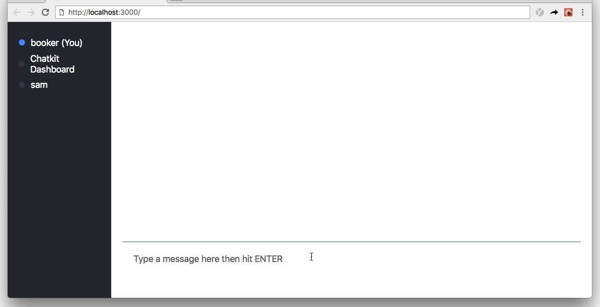
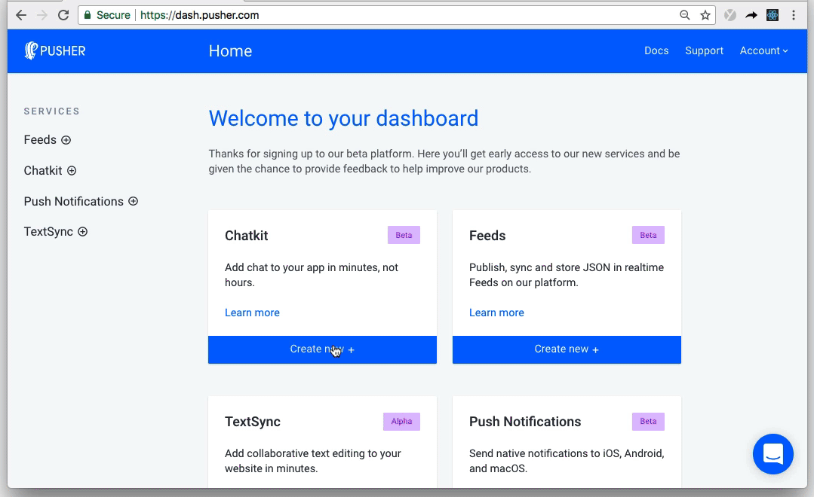
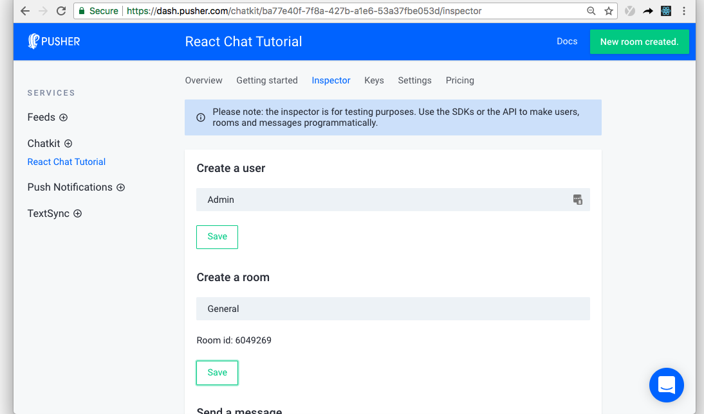

# Slack Clone with React and Pusher Chatkit

In this tutorial, you’ll learn how to build a chat app with React and [Chatkit](https://pusher.com/chatkit?utm_source=github&utm_campaign=build-a-chat-app-with-react-and-pusher-chatkit).

When we're done, we'll have a chat application complete with **typing indicators**, a **"who's online" list**, and **message history**:



## 

Alright, let's code!

## Step 1. Download the repo

To get started, download the repository then run `npm install`:

```
git clone https://github.com/bookercodes/build-a-chat-app-with-react-and-pusher-chatkit chatkit-tutorial
cd chatkit-tutorial
npm install
```


## Step 2. Create your own Chatkit instance

Now you've downloaded the repo, let's create a Chatkit instance.

To create your own Chatkit instance, [head to the dashboard](https://dash.pusher.com/?utm_source=github&utm_campaign=build-a-chat-app-with-react-and-pusher-chatkit) and hit **Create new**:



Give your instance any name (I called mine "React Chat Tutorial") then take note of your **Instance Locator** and **Secret Key** in the **Keys** tab. We'll need them both in the next section.


## Step 3. Create a Chatkit room

When using Chatkit, all messages are sent to a Chatkit room.

Rooms can be created programmatically (on the server or client using `createRoom`), or in the dashboard Inspector tab.

Creating rooms from the Inspector isn't really a good practice (it's mainly intended for testing) but for the purpose of this walkthrough, we'll do it anyway.

In the dashboard, head to the **Inspector** tab and create a user with any name. I will call mine "Admin".

Then, create a room called "General":



It is really important to note the unique **Room id** highlighted above.


## Step 4. Open the repo in a IDE and make some minor changes in the code

Time to replace **"YOUR INSTANCE LOCATOR"** and **"YOUR KEY"** with your own respective values in the following files.
1. ```./server.js``` Line 9: ```instanceLocator: 'YOUR INSTANCE LOCATOR'```
2. ```./server.js``` Line 10. key: ```'YOUR KEY'```
3. ```./components/chatScreen.js``` Line 38: ```instanceLocator: 'YOUR INSTANCE LOCATOR'```
4. ```./components/chatScreen.js``` Line 50: ```roomId: YOUR ROOM ID```

Boom 💥! That's all we need to do with the code. Let's move on to running the code...


## Step 5. Run the server

Can you feel the momentum? Almost done now 🙌

Open terminal and type the following code:

```bash
npm start
```

* Open the browser. Go to ```localhost:3000```. 
* Open a new browser instance/tab to check out the application.
* Login with 2 different usernames. 
* Start sending messages.
* Enjoy!!!

That's all, folks!


## Conclusion

In this walkthrough, I have built a complete chat application with

* group chat;
* a “Who’s online” list; and,
* typing indicators

Because we used Chatkit, we also get some bonus features for free:

* message history (refresh the page and you’ll see up to 100 of the most recent messages);
* reliability in the case that the client temporarily loses connection (Chatkit handles disconnects gracefully); and,
* the ability to scale without needing to worry about infrastructure


